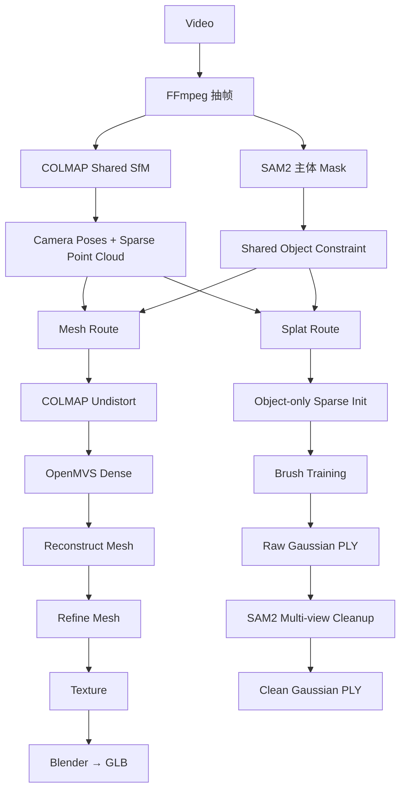

# Videoto3D

**Videoto3D** 是一个本地优先（local-first）的视频到 3D 重建 Studio。  
输入一段围绕目标物体拍摄的视频，在本地完成 **抽帧 → 主体分割 → 相机位姿恢复 → Mesh / Gaussian Splat 双路线重建 → 中间产物检查 → 质量报告 → Web 预览**。

> 当前 Studio：**V1.3.0 · Turntable Capture Mode**

---

## 🎬 教学视频 / Workflow Tutorial

https://github.com/user-attachments/assets/b8d11389-6d23-45dc-a846-226d778f2979

**4 min · Full Workflow Tutorial**

完整演示：

```text
New Run
→ FFmpeg Frames
→ SAM2 ROI / Masks
→ COLMAP Sparse SfM
→ OpenMVS Dense / Mesh / Texture
→ GLB
→ Brush Gaussian Splat
→ Raw / Clean Splat
→ Artifact Inspector
→ Quality Report
```

> 视频使用 GitHub `user-attachments` 直接嵌入 README 播放。  
> 本地原始录像仍保存在 `recordings/`，该目录保持在 `.gitignore` 中。

---

## Capture Modes · 两种拍摄方式

V1.3.0 在 New Run 中明确区分拍摄几何：

| Mode | 实际拍摄 | Shared SfM |
|---|---|---|
| **Orbit Camera** | 物体静止，相机绕物体移动 | 完整 RGB 特征；背景纹理可参与相机定位 |
| **Turntable** | 相机固定，刚体物体旋转 | SAM2 **mask-guided** COLMAP 特征，只让主体参与位姿恢复 |

```text
Orbit Camera
Original RGB ──→ COLMAP ──→ Camera Geometry
       │
       └──→ SAM2 ──→ Mesh / Splat object constraints

Turntable
Original RGB ──→ SAM2 Masks ──→ COLMAP mask-guided features
                                  ↓
                         Equivalent Camera Geometry
```

Turntable 利用刚体相对运动的等价性：物体相对固定相机旋转，可以在物体坐标系中解释为“虚拟相机反向绕物体运动”。关键是 **不能让静止背景特征主导 SfM**。

> Turntable 面向刚体目标。人物只有在姿势、表情、衣服与头发近似不变时才可尝试；走路、挥手、明显肢体运动属于 **Dynamic / 4D reconstruction**，不在当前流程范围内。

详细说明：**[Turntable Capture Mode](docs/guides/Turntable_Capture_Mode.md)**

---

## 30 秒看懂 Videoto3D



Videoto3D 根据拍摄几何选择 Shared SfM 的特征来源：

```text
Orbit Camera : Original RGB ──→ COLMAP ──→ Camera Geometry
Turntable    : RGB + SAM2 Mask ──→ mask-guided COLMAP ──→ Equivalent Camera Geometry
```

两种模式都保留原始 RGB 图像；区别在于 Turntable 会用 SAM2 Mask 限制 COLMAP 的 Feature Extraction，避免固定背景主导位姿估计。后续 Mesh / Splat 继续共享同一套 Camera Geometry。

---

## 你最终会得到什么？

### Mesh Route

```text
COLMAP
→ OpenMVS Dense
→ Triangle Mesh
→ Mesh Refinement
→ Texture Mapping
→ Blender
→ <run_id>.glb
```

最终文件：

```text
workspace/runs/<run_id>/output/<run_id>.glb
```

适合：

- Three.js / Web 3D
- Blender
- 传统 3D Asset 工作流
- 后续编辑、拓扑、动画或格式转换

### Gaussian Splat Route

```text
COLMAP Cameras + Sparse
→ Object Sparse Initialization
→ Brush Gaussian Splat Training
→ Raw PLY
→ Multi-view SAM2 Cleanup
→ Clean PLY
```

最终文件：

```text
workspace/runs/<run_id>/output/<run_id>_splat.ply
```

适合：

- 高保真新视角展示
- 毛绒、复杂纹理、细碎边缘等 Mesh 较难表达的外观
- Web Gaussian Splat Viewer

---

# Quick Start

## 1. 系统前置

当前 Windows 工作流需要系统中已有：

```text
Conda / Anaconda / Miniconda
Node.js + npm
Git
```

Videoto3D 会在项目内部自动管理：

```text
env/
├─ core/   # 主 Pipeline
├─ seg/    # PyTorch CUDA + SAM2
└─ gui/    # FastAPI / Uvicorn
```

第三方运行时与模型放在：

```text
runtime/
```

Run 数据统一放在：

```text
workspace/
```

这些目录都不应进入 Git。

先检查：

```powershell
conda --version
node --version
npm --version
git --version
```

## 2. 启动 Studio

```powershell
cd D:\Desktop\Videoto3D
python app.py gui
```

正常情况下程序会：

```text
检查项目内环境
→ 必要时创建 / 修复 env/core、env/gui
→ 检查前端 Build
→ 启动本地 FastAPI Server
→ 打开 Videoto3D Studio
```

第一次真正运行 SAM2 时才会需要 `env/seg`。

环境状态：

```powershell
python app.py env status
```

环境修复：

```powershell
python app.py env repair core
python app.py env repair seg
python app.py env repair gui
```

工具检查：

```powershell
python app.py doctor
```

---

# GUI 完整工作流

## Step 1 · New Run

在 Studio 首页点击：

```text
New Run
```

填写 Run ID，选择一段围绕目标物体拍摄的视频。

视频会复制到：

```text
workspace/runs/<run_id>/source/
```

随后自动启动 FFmpeg 抽帧。

当前默认：

```text
4 FPS
JPEG quality q:v = 2
```

中间产物：

```text
workspace/runs/<run_id>/frames/
```

---

## Step 2 · 选择主体并运行 SAM2

抽帧结束后，网页显示首帧。

使用鼠标框选：

```text
你真正希望重建的物体
```

点击：

```text
Generate Masks
```

Videoto3D 使用 SAM2 Video Predictor，把第一帧的 Bounding Box 作为 Prompt 并传播到整个序列。

输出：

```text
workspace/runs/<run_id>/masks/
```

文件形式：

```text
frame_0001.jpg.png
frame_0002.jpg.png
...
```

在 **Pipeline Artifacts → SAM2 Masks** 中可以切换：

```text
Original
Mask
Overlay
```

建议在运行两条 3D Route 前先拖动检查多个视角。

---

## Step 3 · Shared COLMAP SfM

Mesh / Splat 都需要同一套：

```text
Camera Intrinsics
Camera Poses
Sparse 3D Points
```

Shared SfM 根据 Capture Mode 选择特征策略：

```text
Orbit Camera
Original RGB → COLMAP Feature Extraction

Turntable
Original RGB + SAM2 Mask
→ COLMAP ImageReader.mask_path
→ 只在主体区域提取 Feature
```

后续两种模式执行相同的几何求解链：

```text
Sequential Matching
→ Incremental Mapping
→ Triangulation
→ Bundle Adjustment
→ Sparse Reconstruction
```

结果位于：

```text
workspace/runs/<run_id>/colmap/
```

Artifact Inspector 中可以检查：

```text
COLMAP Sparse
```

以及 Quality Report 中的：

```text
Registered Images
Sparse Points
Mean Track Length
Mean Reprojection Error
```

---

# Mesh Route

点击：

```text
Run Mesh
```

执行：

```text
COLMAP Undistort
→ InterfaceCOLMAP
→ DensifyPointCloud
→ ReconstructMesh
→ RefineMesh
→ TextureMesh
→ Blender GLB Export
```

## Mesh Settings

Studio 只暴露当前最需要、相对安全的一组参数：

| 参数 | 默认 | 含义 |
|---|---:|---|
| Undistort max image size | 2000 | OpenMVS 输入图像最大尺寸 |
| Dense resolution level | 0 | Dense MVS 使用的图像层级 |
| Dense number views | 0 | 0 = OpenMVS Auto |
| Dense max threads | 0 | 0 = OpenMVS Auto |
| Refine resolution level | 1 | Mesh refinement 图像尺度 |

Texture 的 Seam Leveling 当前保持锁定关闭，这是项目针对 OpenMVS 2.4.0 已记录纹理问题的 workaround。

### Recipe-aware rerun

修改参数不会把所有 Shared 阶段重新跑一遍：

```text
Undistort 参数变化
→ 从 Undistort / Interface 开始

Dense 参数变化
→ 从 Dense 开始

Refine 参数变化
→ 从 Refine 开始
```

Frames、SAM2 Masks、原始 RGB COLMAP Sparse 都继续复用。

---

# Splat Route

点击：

```text
Run Splat
```

执行：

```text
Object-only Sparse
→ Brush Training
→ Raw Splat
→ Multi-view SAM2 Cleanup
→ Clean Splat
```

常用参数：

| 参数 | 默认 | 含义 |
|---|---:|---|
| Steps | 30000 | Brush 训练迭代数 |
| Max splats | 2000000 | Gaussian 数量上限 |
| Resolution | 1280 | 训练图像最大分辨率 |
| FG ratio | 0.60 | 初始化点前景支持阈值 |
| Min FG views | 2 | 初始化点最少前景观察数 |
| Cleanup ratio | 0.70 | 最终 Gaussian 前景支持比例 |
| Cleanup views | 3 | Cleanup 最少有效视角数 |

只修改 Cleanup 参数且 Raw PLY 可复用时，不需要重新执行完整 Brush Training。

---

# Pipeline Artifacts · 中间产物检查

V1.3.0 延续 Artifact Inspector，并增加 **Camera Trajectory**：每个完成的阶段都应该能看见它到底产生了什么。

Run 页面中的 Artifact Inspector 按三组显示：

### Shared

```text
Frames
SAM2 Masks
COLMAP Sparse
Camera Trajectory
```

### Mesh Route

```text
Dense Cloud
Raw Mesh
Refined Mesh
Texture Atlas
Final GLB
```

### Splat Route

```text
Object Sparse
Raw Splat
Clean Splat
```

状态不是只相信 `run.json`，而是结合实际文件检查：

```text
READY
PARTIAL
PENDING
MISSING
```

非常适合排错：

```text
Sparse 就错了
→ 拍摄 / Feature / Matching / SfM

Sparse 正常，Dense 差
→ OpenMVS Dense / 图像覆盖 / 纹理问题

Dense 正常，Mesh 差
→ Reconstruct / Refine

Raw Splat 好，Clean Splat 缺主体
→ Cleanup 阈值过严

Raw Splat 背景很多
→ Mask / Object Sparse / Brush 训练约束
```

Artifact Inspector 还提供：

```text
Raw Mesh ↔ Refined Mesh
Raw Splat ↔ Clean Splat
```

A/B 对比。

---

# Quality Report

不要只看“最终模型好不好看”。

正确检查顺序：

```text
Input Video
↓
Frames
↓
Masks
↓
COLMAP Sparse
↓
Dense / Object Sparse
↓
Mesh / Raw Splat
↓
Final GLB / Clean Splat
```

常见指标：

| 指标 | 看什么 |
|---|---|
| Frame Count | 抽帧是否完整 |
| Mask Count | 是否与 Frame 一一对应 |
| Registered Images | COLMAP 成功注册多少帧 |
| Registration Ratio | 相机位姿覆盖率 |
| Sparse Points | SfM 稀疏几何规模 |
| Reprojection Error | Camera + Point 是否能解释观测 |
| Dense Points | OpenMVS 表面采样规模 |
| Mesh Vertices / Faces | 最终几何复杂度 |
| Raw / Clean Splats | Cleanup 删除了多少 Gaussian |

---

# Paths & Runtime

Run 页面下方的 **Paths & Runtime** 用于查看程序当前真正解析到的：

```text
Project Root
Workspace
Runtime

env/core Python
env/seg Python
env/gui Python

FFmpeg
COLMAP
OpenMVS
Brush
Blender

Current Run:
frames/
masks/
colmap/
mesh/
splat/
GLB
PLY
```

本版只读，避免“查看路径”和“修改机器配置”混在一起。

---

# Workspace Layout

```text
workspace/runs/<run_id>/
├─ run.json
├─ source/
├─ frames/
├─ masks/
├─ segmentation/
├─ colmap/
├─ mesh/
│  ├─ mvs_colmap/
│  ├─ openmvs_masks/
│  ├─ openmvs/
│  └─ blender/
├─ splat/
│  ├─ dataset/
│  ├─ object_sparse_report.json
│  ├─ exports/
│  ├─ raw/
│  └─ cleanup_report.json
├─ output/
│  ├─ <run_id>.glb
│  └─ <run_id>_splat.ply
├─ quality/
└─ logs/
```

---

# CLI · Advanced / Debug

日常使用建议直接：

```powershell
python app.py gui
```

需要调试时再使用 CLI。

<details>
<summary><strong>展开 CLI 命令</strong></summary>

### 环境与工具

```powershell
python app.py doctor
python app.py env status
python app.py env repair core
python app.py env repair seg
python app.py env repair gui
```

### Shared

```powershell
python app.py run extract --run <run_id> --input <video>
python app.py run mask --run <run_id> --box x0,y0,x1,y1
python app.py run sparse --run <run_id>
```

### Mesh

```powershell
python app.py route mesh --run <run_id>
```

带参数：

```powershell
python app.py route mesh --run <run_id> `
  --undistort-max-image-size 2000 `
  --dense-resolution-level 0 `
  --dense-number-views 0 `
  --dense-max-threads 0 `
  --refine-resolution-level 1
```

### Splat

```powershell
python app.py route splat --run <run_id>
```

轻量测试：

```powershell
python app.py route splat --run <run_id> `
  --steps 10000 `
  --max-splats 1000000 `
  --max-resolution 960
```

只调整 Cleanup：

```powershell
python app.py route splat --run <run_id> `
  --cleanup-ratio 0.75 `
  --cleanup-min-views 4
```

### 独立 Viewer

```powershell
python app.py view masks --run <run_id>
python app.py view sparse --run <run_id>
python app.py view splat-init --run <run_id>
python app.py view mesh --run <run_id>
python app.py view glb --run <run_id>
python app.py view splat --run <run_id>
```

### Exact Canonical CLI / Compatibility Reference

下面这组命令由 `pipeline/cli_commands.py` 定义。README 保留精确字符串，既作为高级调试参考，也作为 CLI 文档回归契约。

<!-- CLI_CONTRACT_V130_BEGIN -->

```text
python app.py env status
python app.py env repair <core|seg|gui>
python app.py gui
python app.py doctor
python app.py route mesh --run <run_id> [--input <video>] [--capture-mode orbit_camera|turntable] [--undistort-max-image-size 2000] [--dense-resolution-level 0] [--dense-number-views 0] [--dense-max-threads 0] [--refine-resolution-level 1] [--output-name name.glb] [--output <path>]
python app.py route splat --run <run_id> [--input <video>] [--capture-mode orbit_camera|turntable] [--steps 30000] [--max-splats 2000000] [--max-resolution 1280] [--foreground-ratio 0.6] [--min-foreground-observations 2] [--cleanup-ratio 0.7] [--cleanup-min-views 3]
python app.py run extract --run <run_id> --input <video> [--capture-mode orbit_camera|turntable]
python app.py run mask --run <run_id> [--box x0,y0,x1,y1]
python app.py run sparse --run <run_id>
python app.py run mesh --run <run_id> [--undistort-max-image-size 2000] [--dense-resolution-level 0] [--dense-number-views 0] [--dense-max-threads 0] [--refine-resolution-level 1]
python app.py run glb --run <run_id> [--output-name name.glb] [--output <path>]
python app.py run splat --run <run_id> [--steps 30000] [--max-splats 2000000] [--max-resolution 1280] [--foreground-ratio 0.6] [--min-foreground-observations 2] [--cleanup-ratio 0.7] [--cleanup-min-views 3]
python app.py view masks --run <run_id>
python app.py view sparse --run <run_id>
python app.py view splat-init --run <run_id>
python app.py view mesh (--run <run_id> | --path <obj>)
python app.py view glb (--run <run_id> | --path <glb>)
python app.py view splat (--run <run_id> | --path <ply>)
python app.py quality --run <run_id>
python app.py runs list
python app.py runs show <run_id>
```

兼容/工程参考：

```text
Run root              : workspace/runs/<run_id>/
OpenMVS staged mask   : frame_0001.mask.png
Raw Gaussian SPLAT    : splat/raw/<run_id>_raw.ply
Quality JSON          : quality/report.json
Bug registry          : docs/bugs/README.md
GUI control           : gui/control
Reusable viewer       : gui/viewer
```

`gui/control` 属于 Videoto3D Control Plane，负责调用 Core CLI；`gui/viewer` 保持通用 Viewer，不依赖 Run / COLMAP / OpenMVS 业务概念。

<!-- CLI_CONTRACT_V130_END -->

</details>

---

# 进一步学习

如果你不想只知道“这样跑能得到模型”，而希望理解每一步**为什么成立、输入输出是什么、数学上发生了什么**：

**→ [Videoto3D 工作流基础知识与数学框架](docs/guides/Videoto3D_Workflow_Knowledge_Framework.md)**

内容包括：

```text
Pinhole Camera
Homogeneous Coordinates
Camera Intrinsics / Extrinsics
SIMPLE_RADIAL Distortion
Feature / Descriptor
Sequential Matching
Epipolar Geometry
Essential / Fundamental Matrix
RANSAC
Incremental SfM
PnP
Triangulation
Bundle Adjustment
Reprojection Error
MVS / Depth
Dense Fusion
Mesh Reconstruction
Mesh Refinement
UV / Texture Mapping
GLB
3D Gaussian
Covariance
Gaussian Projection
Alpha Compositing
Spherical Harmonics
Brush Training
Object Sparse
Multi-view Splat Cleanup
```

录制 / 发布 GitHub Demo：

**→ [Workflow Video Recording Guide](docs/guides/Videoto3D_Workflow_Video_Recording.md)**

---

# 关键工程原则

1. **Run 数据只在 `workspace/` 中。**
2. **第三方 Runtime / Model 只在 `runtime/` 中。**
3. **项目 Python 环境只在 `env/` 中。**
4. **Orbit Camera 使用完整 RGB 做 Shared SfM；Turntable 使用 SAM2 mask-guided Feature Extraction。**
5. **SAM2 Mask 独立存在：不生成 Masked RGB；Turntable 只把 Mask 作为 COLMAP Feature 区域约束。**
6. **Mesh / Splat 共享同一套 Camera Geometry。**
7. **Raw Splat 永久保留，Cleanup 不覆盖 Raw。**
8. **GUI Control 调 Core CLI，不复制重建算法。**
9. **`gui/viewer` 保持通用，不依赖 Run / COLMAP / OpenMVS 概念。**
10. **中间产物是 Pipeline 的一等公民：能看、能查、能定位失败阶段。**

---

# Third-party Components

| Component | Videoto3D 中的职责 |
|---|---|
| FFmpeg | 视频抽帧 |
| SAM2 | Promptable Video Object Segmentation |
| COLMAP | Feature / Matching / Camera Pose / Sparse SfM |
| OpenMVS | Dense Point Cloud / Mesh / Refine / Texture |
| Brush | Gaussian Splat Training |
| Blender | GLB 导出 |
| FastAPI | 本地 Control Server |
| React | Studio 前端 |
| Three.js | GLB / PLY Geometry Viewer |
| Spark | Gaussian Splat Web Viewer |

Videoto3D 不重新实现这些成熟算法，而是负责：

```text
环境管理
数据组织
参数与缓存策略
双 Route 编排
目标 Mask 约束
Gaussian 后处理
Artifact Inspector
Quality Report
本地 Web Workflow
```

---

# Known Notes

- OpenMVS 2.4.0 Texture 阶段当前保留 Seam Leveling workaround，详见 `docs/bugs/BUG-0001-openmvs-2.4.0-texture-black-artifacts.md`。
- 浏览器 Artifact Inspector 当前显示 COLMAP Sparse Points；完整 Camera Frustum 仍可使用 COLMAP Viewer 查看。
- 原始录制视频、Runtime、Python 环境和生成模型不应直接进入 Git 仓库。

---

## Repository

```text
HUliangwei/Videoto3D
```

如果你第一次接触这个项目，推荐阅读顺序：

```text
README
→ 启动 GUI 跑一次 Workflow
→ Pipeline Artifacts 看每一步
→ Workflow Knowledge Framework
→ 再开始调 Mesh / Splat 参数
```
