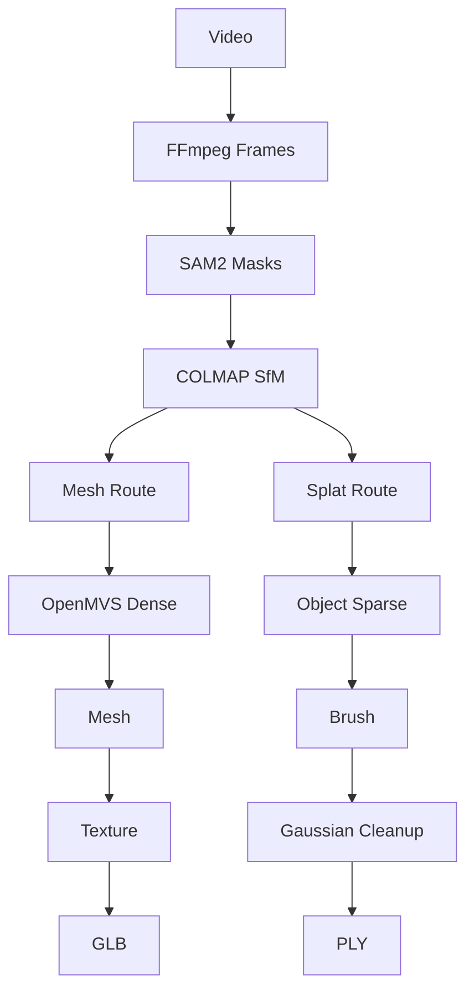

# Videoto3D 工作流基础知识与 GitHub 展示指南

> 目标：把 Videoto3D 从“会用”提升到“理解每一步为什么这样做、输入输出是什么、参数影响什么、如何判断结果好坏”。

---

# 1. 整体流程总览

Videoto3D 当前把流程分成一个共享阶段（Shared）和两条输出路线：

```text
Video
  ↓
FFmpeg 抽帧
  ↓
SAM2 主体分割
  ↓
COLMAP SfM
  ├─ 相机内参
  ├─ 相机位姿
  └─ 稀疏点云
  ↓
Shared 完成
  │
  ├─────────────────────────────┐
  │                             │
  ↓                             ↓
Mesh Route                  Splat Route
  ↓                             ↓
COLMAP Undistort            Object Sparse Init
  ↓                             ↓
OpenMVS Dense               Brush Gaussian Splat
  ↓                             ↓
Reconstruct Mesh            Raw Gaussian PLY
  ↓                             ↓
Refine Mesh                 SAM2 Multi-view Cleanup
  ↓                             ↓
Texture Mesh                Final Gaussian PLY
  ↓
Blender
  ↓
GLB
```

核心思想：

- **Shared 阶段负责“理解相机和场景几何关系”**
- **Mesh Route 把场景变成显式三角网格**
- **Splat Route 把场景表示成大量 3D Gaussian**
- SAM2 的主体 Mask 同时服务于后续两条路线的目标隔离

---

# 2. 输入视频：为什么视频可以生成 3D

一个静态物体从不同方向拍摄时，同一个三维点会出现在多个二维图像中。

例如小熊鼻尖：

```text
Camera A                  Camera B
   \                         /
    \                       /
     \                     /
      ● 鼻尖真实 3D 坐标
```

如果我们知道：

1. 鼻尖在图像 A 中的位置；
2. 鼻尖在图像 B 中的位置；
3. Camera A 和 Camera B 的位置和方向；

就可以通过几何关系估计这个点在三维空间中的位置。

所以“视频转 3D”本质上不是直接理解视频，而是：

```text
视频
→ 大量不同视角的照片
→ 找到同一个特征在不同照片中的对应关系
→ 求相机运动
→ 三角测量得到 3D
```

---

# 3. FFmpeg 抽帧

## 3.1 做什么

FFmpeg 将视频转换成连续静态图片：

```text
input.mp4
  ↓
frame_0001.jpg
frame_0002.jpg
frame_0003.jpg
...
```

## 3.2 为什么不能直接把视频交给 COLMAP

COLMAP 的主要输入单位是图像。

视频中存在大量几乎完全相同的相邻帧，如果全部使用：

- 计算量很大；
- 图像冗余严重；
- 匹配收益有限。

因此需要通过 FPS 控制抽帧密度。

例如：

```text
30 FPS 原视频
↓
4 FPS 抽帧
```

可以显著降低数据量。

## 3.3 抽帧太少和太多分别会怎样

太少：

- 相邻视角变化过大；
- 特征匹配困难；
- COLMAP 注册率下降；
- 物体某些角度没有覆盖。

太多：

- 计算变慢；
- 图像高度重复；
- 数据量膨胀；
- 对最终质量提升有限。

## 3.4 GUI 应显示的中间产物

建议显示：

- 总帧数；
- FPS；
- 首帧；
- 中间帧；
- 末帧；
- 缩略图时间轴。

目录：

```text
workspace/runs/<run_id>/frames/
```

---

# 4. SAM2 主体分割

## 4.1 SAM2 在这里解决什么问题

原视频里通常包含：

```text
目标物体 + 桌面 + 地面 + 墙 + 手 + 其他环境
```

而我们真正希望重建的是：

```text
目标物体
```

SAM2 根据用户第一帧给出的 Bounding Box：

```text
┌──────────────────────┐
│                      │
│   ┌────────────┐     │
│   │   Doll     │     │
│   └────────────┘     │
│                      │
└──────────────────────┘
```

得到每一帧的二值 Mask：

```text
目标像素 = 255
背景像素 = 0
```

## 4.2 Mask 是什么

Mask 可以理解成与原图同尺寸的黑白图：

```text
RGB Frame                 Mask

[人物 + 地面]             [白色人物]
                          [黑色背景]
```

它不包含颜色，只表达：

> 哪些像素属于目标。

## 4.3 为什么不直接把背景涂黑以后做 COLMAP

Videoto3D 当前采用：

```text
COLMAP：原始 RGB 图像
SAM2：独立 Mask
```

这是一个重要设计。

因为背景本身也包含大量稳定的视觉特征。

如果把所有背景删掉：

- 相机定位会缺少大量特征；
- 特别是纯色、光滑、小型物体；
- COLMAP 可能无法稳定估计相机位姿。

所以我们让：

```text
原始 RGB
→ 负责 Camera Pose / SfM

Mask
→ 负责目标隔离
```

## 4.4 GUI 应显示什么

SAM2 完成后建议提供：

```text
[Original] [Mask] [Overlay]
```

Overlay：

```text
原始图片
+
半透明 Mask
```

这是最容易人工判断分割是否正确的方式。

还应该显示：

```text
Masks: 80 / 80
Coverage: COMPLETE
```

目录：

```text
workspace/runs/<run_id>/masks/
```

---

# 5. COLMAP：SfM 是整个项目的几何基础

COLMAP 是 Videoto3D 最重要的共享模块。

它主要执行：

```text
Feature Extraction
↓
Feature Matching
↓
Structure from Motion
↓
Sparse Reconstruction
```

---

# 6. Feature Extraction：特征提取

## 6.1 什么是图像特征

计算机不会直接理解：

> “这是小熊的眼睛”。

它寻找的是局部视觉特征，例如：

- 角点；
- 边缘附近稳定纹理；
- 高对比度区域；
- 局部纹理模式。

典型形式：

```text
图像
↓
Keypoints
(x1,y1)
(x2,y2)
...
↓
Descriptors
```

Descriptor 是描述这个局部图像区域的一串数字。

---

# 7. Feature Matching：特征匹配

下一步是判断：

```text
frame_001 的这个点
和
frame_015 的那个点
```

是不是同一个真实三维位置。

例如：

```text
Image A                Image B

    ● 鼻子        ↔        ● 鼻子
```

匹配越准确，后面的相机定位越稳定。

错误匹配过多会导致：

- 相机位姿错误；
- 点云飞散；
- SfM 重建失败。

---

# 8. Camera Intrinsics：相机内参

内参描述：

> 摄像头本身如何把 3D 世界投影到 2D 图像。

典型参数：

```text
fx, fy   焦距
cx, cy   主点
畸变参数
```

数学上可以简化理解为：

```text
3D Camera Point
(X,Y,Z)

    ↓ perspective projection

u = fx * X/Z + cx
v = fy * Y/Z + cy
```

所以知道 3D 点，就能计算它应该落在图像的哪个像素。

这个公式以后也被 Videoto3D 的 Splat Cleanup 使用。

---

# 9. Camera Extrinsics / Pose：相机位姿

外参表示：

```text
Camera 在世界坐标中的位置
+
Camera 朝哪个方向看
```

通常通过：

```text
Rotation R
Translation t
```

表示。

视频绕着物体拍摄以后，COLMAP 最终恢复的是类似：

```text
      Camera
       ●
    ●       ●
  ●    Doll   ●
    ●       ●
       ●
```

这就是你在 COLMAP Viewer 中看到的一圈红色相机。

---

# 10. SfM：Structure from Motion

SfM 的全称：

> Structure from Motion

含义是：

> 从相机运动中恢复三维结构。

它同时求：

```text
Camera Pose
+
Sparse 3D Points
```

这是一个相互优化过程。

---

# 11. 三角测量 Triangulation

当一个真实点在多个相机中被观察到：

```text
Camera A                 Camera B
    \                       /
     \                     /
      \                   /
             ●
```

可以根据两条视线的交会位置估计 3D 坐标。

这就是三角测量。

最后形成：

```text
points3D
```

---

# 12. Bundle Adjustment

最初估计的：

- Camera Pose；
- 3D Point；

都存在误差。

Bundle Adjustment 会联合优化：

```text
所有 Camera
+
所有 3D Points
```

目标是让：

```text
3D 点投影回图像的位置
```

尽可能接近真实检测到的 2D feature。

---

# 13. Reprojection Error

这是非常重要的质量指标。

假设：

```text
真实 feature: (300, 200)

根据当前 Camera + 3D Point
预测投影:     (301, 201)
```

误差约：

```text
sqrt(1² + 1²)
≈ 1.41 pixels
```

平均 Reprojection Error 越低通常越好。

但不能只看这个指标，还要结合：

- 注册率；
- 点数；
- 相机轨迹；
- 是否存在错误相机。

---

# 14. Registered Images

如果：

```text
80 帧输入
80 帧成功求出 Camera Pose
```

则：

```text
Registration = 100%
```

例如：

```text
114 / 120
= 95%
```

说明 114 张照片被成功加入 SfM 模型。

高注册率通常说明：

- 视频覆盖连续；
- 特征足够；
- 模糊帧较少；
- 光照变化不严重。

---

# 15. Sparse Point Cloud

COLMAP 输出的点云叫：

```text
Sparse Point Cloud
```

它的作用主要是：

1. 证明几何已经恢复；
2. 为后面的 Dense / Splat 提供相机和初始化。

它**不是最终 3D 模型**。

可能只有几千、几万个点。

GUI 应显示：

```text
Registered Cameras
Sparse Points
Reprojection Error
COLMAP 3D Viewer
```

目录：

```text
workspace/runs/<run_id>/colmap/
```

---

# 16. Shared 阶段为什么值得两条路线共享

到这一阶段，我们已经得到：

```text
frames
masks
camera intrinsics
camera poses
sparse points
```

无论最终要：

```text
Mesh
```

还是：

```text
Gaussian Splat
```

这些信息都必须先知道。

因此它们属于：

```text
Shared
```

而不是两条路线分别重新计算。

---

# 17. Mesh Route 总览

```text
COLMAP
↓
Undistort
↓
InterfaceCOLMAP
↓
Dense Point Cloud
↓
Mesh Reconstruction
↓
Mesh Refinement
↓
Texture Mapping
↓
Blender
↓
GLB
```

---

# 18. COLMAP Undistort

真实摄像头通常存在镜头畸变：

```text
直线
→
略微弯曲
```

而 OpenMVS 更希望使用标准针孔相机图像。

所以 COLMAP Undistort 会：

```text
原始图像
+
Camera calibration
↓
去畸变图像
```

参数：

```text
Max image size
```

控制送给 OpenMVS 的最大图像分辨率。

太高：

- 更慢；
- 更吃内存/显存；
- 可能保留更多细节。

太低：

- 更快；
- 细节可能下降。

---

# 19. OpenMVS InterfaceCOLMAP

COLMAP 和 OpenMVS 使用的内部数据格式不同。

InterfaceCOLMAP 的作用：

```text
COLMAP reconstruction
↓
转换
↓
OpenMVS scene.mvs
```

它本身通常不产生新的几何，只是格式桥接。

---

# 20. Dense Reconstruction / MVS

MVS：

> Multi-View Stereo

SfM 只在稳定视觉特征位置生成 sparse points。

但最终 Mesh 需要非常多的表面点。

Dense MVS 会：

```text
每一个 Camera
+
邻近 Camera
+
像素颜色/纹理一致性
↓
估计深度
```

产生：

```text
Dense Point Cloud
```

例如：

```text
Sparse: 20,000 points

Dense:
500,000+
points
```

## Dense Resolution Level

控制 Dense 阶段使用的图像尺度。

通常：

```text
0 = 原始/最高允许分辨率
1 = 降一级
2 = 再降低
```

分辨率越高：

- 细节更多；
- 时间和内存成本明显增加。

---

# 21. Mesh Reconstruction

Dense Point Cloud 仍然只是点：

```text
● ● ● ●
 ● ● ●
● ● ● ●
```

Mesh Reconstruction 会把点连接成三角面：

```text
▲▲▲▲▲
▲▲▲▲▲
```

输出：

```text
Vertices
Faces
```

例如：

```text
2286 vertices
4536 faces
```

网格才是传统 3D 软件真正理解的“模型表面”。

---

# 22. Mesh Refinement

第一次生成的 Mesh 可能：

- 面数过多；
- 表面粗糙；
- 三角形质量差；
- 位置与真实图像不完全吻合。

Refine 会重新利用多视角图像优化网格表面位置。

目标：

```text
Mesh 投影到各照片
↓
与照片中的真实表面更一致
```

---

# 23. Texture Mapping

前面的 Mesh 只有：

```text
几何
```

还没有真实外观。

TextureMesh 会根据相机照片，把颜色投射到 Mesh 上：

```text
照片
↓
UV / Texture Atlas
↓
Mesh
```

输出通常包括：

```text
OBJ
MTL
Texture PNG/JPG
```

## Videoto3D 当前特殊注意

当前 OpenMVS 2.4.0 使用了一个纹理 workaround：

```text
Global Seam Leveling = OFF
Local Seam Leveling  = OFF
```

这是为了避免已经遇到过的黑纹理问题。

所以 GUI 中这部分虽然显示，但暂时锁定。

---

# 24. Blender → GLB

OBJ 常常是多个文件：

```text
model.obj
model.mtl
texture.png
```

而 GLB 可以把：

```text
Mesh
Material
Texture
```

统一打包成一个文件：

```text
model.glb
```

优点：

- 浏览器容易加载；
- Three.js 原生支持；
- 个人网站方便使用；
- 单文件部署。

所以 GLB 是 Mesh Route 的最终发布格式。

---

# 25. Gaussian Splat Route 总览

```text
COLMAP Cameras + Sparse
↓
Object Sparse Initialization
↓
Brush
↓
Gaussian Training
↓
Raw PLY
↓
SAM2 Multi-view Cleanup
↓
Final PLY
```

---

# 26. Gaussian Splat 是什么

传统 Mesh：

```text
Vertex + Triangle + Texture
```

Gaussian Splat：

```text
大量带颜色、透明度、方向和尺寸的 3D Gaussian
```

一个 Gaussian 可以想象成：

```text
一个三维半透明椭球小云团
```

大量 Gaussian 叠加：

```text
◌ ◌ ◌ ◌ ◌
  ◌ ◌ ◌
◌ ◌ ◌ ◌
```

形成完整物体视觉。

---

# 27. 每个 Gaussian 大致包含什么

典型参数：

```text
Position
x, y, z

Scale
sx, sy, sz

Rotation
quaternion

Opacity

Color / SH coefficients
```

其中 SH：

> Spherical Harmonics

用于表达不同观察方向下颜色/光照的变化。

---

# 28. 为什么 Splat 看起来常比 Mesh 更真实

Mesh 必须先：

```text
恢复准确表面
→ 建三角形
→ 做 UV
→ 做 Texture
```

任何阶段误差都会影响最终外观。

Gaussian Splat 更直接地优化：

```text
“从 Camera 看过去，渲染结果应该和原始照片一样”
```

所以在：

- 毛绒；
- 头发；
- 反光；
- 复杂细小纹理；

场景中经常视觉效果很好。

---

# 29. Brush Training

Brush 根据：

```text
COLMAP cameras
+
images
+
initial points
```

优化 Gaussian。

训练过程会不断：

```text
移动 Gaussian
调整尺寸
调整透明度
调整颜色
增加/拆分 Gaussian
```

目标是：

```text
Rendered Image
≈
Original Image
```

---

# 30. Steps

例如：

```text
10000 steps
30000 steps
```

代表优化迭代次数。

更多 steps：

- 通常有机会得到更好的收敛；
- 时间更长；
- 后期收益可能递减。

---

# 31. Max Splats

限制最多 Gaussian 数量：

```text
1,000,000
2,000,000
```

更多 Gaussian：

- 可以表达更多细节；
- 显存和文件大小增加；
- Viewer 开销增加。

---

# 32. Object-only Sparse Initialization

最初 Brush 会根据 COLMAP points 初始化 Gaussian。

问题是 COLMAP sparse 里包含：

```text
目标
+
环境
```

所以 Videoto3D 用 SAM2 Mask 对 COLMAP 3D points 做多视角投票：

```text
3D Point
↓
投影到多个 Camera
↓
查询 Mask
↓
判断它是否属于目标
```

只把较高置信度目标点作为 Brush 初始化。

它的作用：

> 从一开始减少背景 Gaussian。

---

# 33. 为什么训练以后背景还会重新出现

Brush 训练过程中会：

```text
densify
split
move
clone
```

因此即使初始点很干净，也可能在物体附近重新产生一些环境/halo Gaussian。

所以仅过滤初始化不够。

---

# 34. Splat Cleanup

Videoto3D 对最终 Brush Gaussian 再做一次目标筛选。

算法：

```text
Final Gaussian XYZ
↓
投影到所有有效 COLMAP Camera
↓
查询每个 Camera 对应 SAM2 Mask
↓
foreground votes / valid views
↓
KEEP 或 REMOVE
```

例如：

```text
8 个 Camera 看见该 Gaussian

7 个落在 Mask 内
1 个落在 Mask 外

Foreground Ratio = 7/8
                 = 87.5%
```

如果：

```text
ratio >= cleanup threshold
```

则保留。

这样可以不重新训练，直接删除背景 splats。

---

# 35. Mesh 和 Splat 的本质区别

| 特性 | Mesh | Gaussian Splat |
|---|---|---|
| 表示方法 | Triangle | Gaussian |
| 几何结构 | 明确 | 隐式/点式 |
| 编辑 | 很方便 | 相对困难 |
| 物理/碰撞 | 好 | 不适合 |
| 游戏引擎 | 成熟 | 仍在发展 |
| 网页展示 | GLB 很成熟 | WebGPU/专用 renderer |
| 写实外观 | 依赖 mesh + texture | 通常较强 |
| 毛发/复杂边缘 | 容易损失 | 通常表现更好 |
| 文件 | GLB | PLY |

所以：

```text
Mesh
适合“真正的传统 3D 资产”

Splat
适合“高保真视觉重建”
```

Videoto3D 同时保留两条路线是有意义的。

---

# 36. Quality Report 应该怎么看

## Shared

重点：

```text
Frames
Masks
COLMAP Registration
Sparse Points
Reprojection Error
```

## Mesh

重点：

```text
Dense Points
Vertices
Faces
Texture
GLB
```

## Splat

重点：

```text
Training Steps
Raw Splats
Clean Splats
Removed Ratio
```

---

# 37. 建议 GUI 显示的全部中间产物

这是下一阶段 GUI 非常值得补充的能力。

## Shared

### Extract 完成

显示：

```text
Frames Gallery
```

### Mask 完成

显示：

```text
Original
Mask
Overlay
```

支持上一帧/下一帧。

### Sparse 完成

显示：

```text
COLMAP cameras + sparse cloud
```

并显示：

```text
registered / total
sparse points
reprojection error
```

---

# 38. Mesh Route 中间产物

## Undistort

显示：

```text
Original vs Undistorted
```

主要用于理解畸变校正。

## Dense

显示：

```text
Dense Point Cloud
```

这一步非常重要。

用户应该能看到：

```text
Sparse
→
Dense
```

到底增加了多少表面信息。

## Reconstruct

显示：

```text
Raw Mesh
```

无纹理灰模。

## Refine

显示：

```text
Refined Mesh
```

建议与 Raw Mesh 可以切换对比。

## Texture

显示：

```text
Textured OBJ
Texture Atlas
```

特别是 Texture Atlas 很适合作为知识展示。

## GLB

最终：

```text
Web 3D Viewer
```

---

# 39. Splat Route 中间产物

## Object Sparse

显示：

```text
All Cameras
+
Filtered Object Points
```

## Brush Raw

显示：

```text
Raw Gaussian Splat
```

## Cleanup

应该同时保留：

```text
Before Cleanup
After Cleanup
```

GUI 最适合做：

```text
[Raw] [Clean]
```

A/B 切换。

## Final

最终：

```text
Gaussian Splat Viewer
```

---

# 40. 推荐的 GUI 中间产物结构

Run 页面可以增加：

```text
PIPELINE ARTIFACTS

Shared
  [Frames]
  [Masks]
  [Sparse]

Mesh Route
  [Dense Cloud]
  [Raw Mesh]
  [Refined Mesh]
  [Texture Atlas]
  [GLB]

Splat Route
  [Object Sparse]
  [Raw Splat]
  [Clean Splat]
```

完成一个步骤以后，相应按钮自动解锁。

这个设计同时兼具：

1. 调试；
2. 学习；
3. GitHub Demo；
4. 质量检查。

---

# 41. 一个实用的排错知识框架

如果最终 3D 不好，不要直接怪最终算法。

应该从上往下找：

```text
视频好吗？
↓
抽帧覆盖好吗？
↓
SAM2 Mask 对吗？
↓
COLMAP Camera Pose 对吗？
↓
Sparse 点云对吗？
↓
Dense / Brush 输入好吗？
↓
最终结果好吗？
```

例如：

## Camera 已经乱了

那后面：

```text
OpenMVS
Brush
```

基本都不会正常。

## Camera 正常，但 Mesh 差

重点检查：

```text
Dense
Reconstruct
Texture
```

## Camera 正常，Splat 主体很好但背景多

检查：

```text
Object Sparse
Cleanup
```

这个思路比盲目调最终参数有效得多。

---

# 42. GitHub README 应该展示什么

建议 README 不要只是文字。

一个 3D 项目的 README 最重要的是：

```text
别人 15 秒以内能看懂：
这是干什么的？
输入是什么？
输出是什么？
效果如何？
```

README 首屏建议：

```markdown
# Videoto3D

Video → Mesh GLB + Gaussian Splat PLY

[Demo GIF / Video]

输入视频
↓
SAM2 + COLMAP
↓
Mesh / Gaussian Splat

[Mesh screenshot] [Splat screenshot]
```

---

# 43. README 推荐结构

```text
1. Hero
2. Demo
3. Features
4. Pipeline
5. Results
6. GUI
7. Installation
8. Quick Start
9. Project Structure
10. Technical Details
11. Known Issues
12. Roadmap
```

---

# 44. Hero 区应该很短

例如：

```markdown
# Videoto3D

A local-first video-to-3D reconstruction studio.

Input one object video and generate:

- Textured GLB via COLMAP + OpenMVS
- Gaussian Splat PLY via Brush
- SAM2-based object isolation
- Local Web GUI for the complete workflow
```

紧接着放 Demo。

---

# 45. 最值得录制的视频

不要直接上传一条 15 分钟全流程屏幕录像作为 README 主展示。

推荐制作两种视频。

## A. README 主 Demo：60~90 秒

内容：

```text
0-5s
展示原视频

5-10s
New Run

10-18s
抽帧 + 浏览器框选主体

18-25s
SAM2 Masks

25-35s
COLMAP Sparse Cameras

35-45s
Mesh intermediate stages

45-55s
GLB Result

55-65s
Brush training / progress

65-75s
Raw → Cleanup Splat

75-90s
Mesh / Splat 双结果旋转展示
```

耗时步骤全部加速。

---

# 46. 完整 Workflow Video

另外再录一条：

```text
5~15 分钟
```

完整操作教学。

README 放链接：

```markdown
## Full Workflow

▶ Watch the complete reconstruction workflow
```

完整视频可以上传：

- Bilibili；
- YouTube；
- GitHub Release；
- 个人网站。

---

# 47. README 不建议直接放大 MP4

GitHub README 对视频嵌入体验不如 GIF/图片稳定。

推荐：

```text
README
↓
20~40 秒轻量 GIF / WebP
↓
点击封面
↓
完整 MP4 / Bilibili / YouTube
```

如果 GIF 太大：

```text
1080p
↓
720p
↓
10~15 FPS
```

通常已经足够演示 UI。

---

# 48. 最推荐的录制方式

Windows 上使用：

```text
OBS Studio
```

推荐设置：

```text
Canvas: 1920×1080
Output: 1920×1080
FPS: 30
Codec: H.264
```

只录：

```text
浏览器窗口
+
必要时少量终端
```

不要把桌面杂项全部录进去。

---

# 49. Demo 视频的画面重点

建议录制一个新对象，不要只用 teddy。

例如：

```text
ceramics_doll
```

过程：

```text
Input Video
↓
ROI Selection
↓
Mask Preview
↓
Sparse Cameras
↓
Dense Point Cloud
↓
Raw Mesh
↓
Textured GLB
↓
Raw Gaussian
↓
Clean Gaussian
```

这是最能解释 Videoto3D 技术含量的一条录像。

---

# 50. README Pipeline 图

推荐直接使用 Mermaid：



这样 GitHub 可以直接渲染。

---

# 51. README Results 建议

建议做同一物体对比：

```text
INPUT
[video thumbnail]

MESH
[GLB screenshot]

SPLAT
[PLY screenshot]
```

并配数据：

```text
Frames              80
COLMAP Registration 100%
Sparse Points        20,419

Mesh
Vertices             2,286
Faces                4,536

Splat
Raw Splats           15,114
Clean Splats          9,163
Removed              39.4%
```

这种内容比只说：

> “效果很好”

更有工程可信度。

---

# 52. 中间产品也应该成为 README 的卖点

推荐放：

```text
What happens inside?
```

然后：

```text
Frames
↓
Masks
↓
Sparse Reconstruction
↓
Dense Point Cloud
↓
Mesh
```

另一侧：

```text
Sparse
↓
Gaussian initialization
↓
Raw Splat
↓
Cleanup
```

这能让别人知道 Videoto3D 不是简单封装某一个工具。

---

# 53. 建议 README 中明确第三方组件职责

例如：

| Component | Role |
|---|---|
| FFmpeg | Video frame extraction |
| SAM2 | Object segmentation |
| COLMAP | Camera pose + SfM |
| OpenMVS | Dense reconstruction + mesh |
| Brush | Gaussian Splat training |
| Blender | GLB export |
| FastAPI | Local control server |
| React | Local Web Studio |
| Three.js | GLB visualization |
| Spark | Gaussian Splat visualization |

这样架构非常清楚。

---

# 54. 你现在最应该掌握的知识树

```text
Videoto3D
│
├─ Computer Vision
│  ├─ Camera Model
│  ├─ Feature
│  ├─ Matching
│  ├─ SfM
│  ├─ Triangulation
│  └─ Bundle Adjustment
│
├─ Segmentation
│  ├─ SAM2
│  └─ Mask
│
├─ Multi-View Geometry
│  ├─ Intrinsics
│  ├─ Extrinsics
│  ├─ Projection
│  └─ Reprojection Error
│
├─ Traditional 3D Reconstruction
│  ├─ MVS
│  ├─ Dense Point Cloud
│  ├─ Mesh
│  ├─ Refinement
│  ├─ UV
│  └─ Texture
│
├─ Gaussian Splatting
│  ├─ Gaussian
│  ├─ Position
│  ├─ Covariance
│  ├─ Opacity
│  ├─ SH
│  ├─ Densification
│  └─ Rendering
│
└─ Engineering
   ├─ Pipeline
   ├─ Workspace
   ├─ Recipe
   ├─ Quality Report
   ├─ Local GUI
   └─ Reproducible Environment
```

---

# 55. 建议你的学习顺序

不要现在去系统学习整本计算机视觉教材。

围绕项目按这个顺序即可：

```text
1. Camera Projection
2. Feature / Matching
3. SfM
4. Triangulation
5. Bundle Adjustment
6. MVS / Depth
7. Point Cloud → Mesh
8. UV / Texture
9. Gaussian Splat
10. SAM2 / Segmentation
```

每学一个概念，都回到 Videoto3D 找它对应的：

```text
输入
输出
文件
GUI
参数
质量指标
```

这样知识最容易真正留下来。

---

# 56. 最终理解目标

当你看到：

```text
Video
→ SAM2
→ COLMAP
→ OpenMVS
```

不要只知道：

> “这个命令能跑出 GLB”。

而应该能解释：

```text
视频提供多视角
↓
SAM2 提供主体像素约束
↓
COLMAP 从图像匹配恢复 Camera Pose 和 Sparse Geometry
↓
OpenMVS 根据已知 Camera 做 Multi-View Stereo
↓
Dense Point Cloud
↓
Triangle Mesh
↓
Multi-view Texture Projection
↓
GLB
```

同理 Splat：

```text
COLMAP Camera / sparse geometry
↓
初始化 3D Gaussian
↓
Brush 根据多视角照片优化 Gaussian
↓
得到高保真视觉表示
↓
再次利用 SAM2 Mask 对最终 Gaussian 做多视角投影投票
↓
删除非主体 Gaussian
↓
得到 Clean PLY
```

能够完整讲出这两个故事时，你就已经不只是“会使用 Videoto3D”，而是真正理解了这个项目的技术路线。
